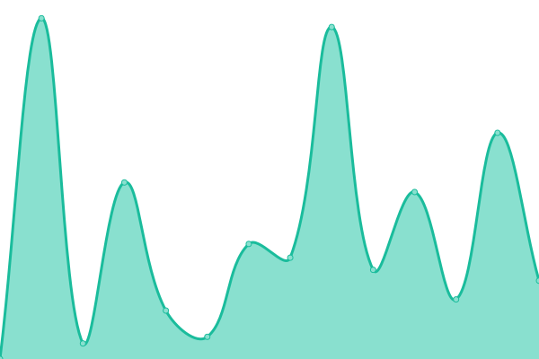

# [📈 Live Status](https://status.futureporn.net): <!--live status--> **🟩 All systems operational**

This repository contains the open-source uptime monitor and status page for [Upptime](https://upptime.js.org), powered by [Upptime](https://github.com/upptime/upptime).

With [Upptime](https://upptime.js.org), you can get your own unlimited and free uptime monitor and status page, powered entirely by a GitHub repository. We use [Issues](https://github.com/upptime/upptime/issues) as incident reports, [Actions](https://github.com/insanity54/futureporn-status/actions) as uptime monitors, and [Pages](https://status.futureporn.net) for the status page.

<!--start: status pages-->
<!-- This summary is generated by Upptime (https://github.com/upptime/upptime) -->
<!-- Do not edit this manually, your changes will be overwritten -->
<!-- prettier-ignore -->
| URL | Status | History | Response Time | Uptime |
| --- | ------ | ------- | ------------- | ------ |
|  [Frontend](https://futureporn.net) | 🟩 Up | [frontend.yml](https://github.com/insanity54/futureporn-status/commits/HEAD/history/frontend.yml) | 

 393ms
     
 | 

<a href="https://status.futureporn.net/history/frontend">99.89%</a>
    

|  [IPFS Cluster Peer 1](https://38.242.216.6:9094) | 🟩 Up | [ipfs-cluster-peer-1.yml](https://github.com/insanity54/futureporn-status/commits/HEAD/history/ipfs-cluster-peer-1.yml) | 

 544ms
     
 | 

<a href="https://status.futureporn.net/history/ipfs-cluster-peer-1">99.53%</a>
    

|  [IPFS Cluster Peer 2](https://45.32.201.82:9094) | 🟩 Up | [ipfs-cluster-peer-2.yml](https://github.com/insanity54/futureporn-status/commits/HEAD/history/ipfs-cluster-peer-2.yml) | 

 236ms
     
 | 

<a href="https://status.futureporn.net/history/ipfs-cluster-peer-2">99.41%</a>
    

|  [Pin Inclusion](https://sbtp.xyz/qa/v1/missing-pins) | 🟩 Up | [pin-inclusion.yml](https://github.com/insanity54/futureporn-status/commits/HEAD/history/pin-inclusion.yml) | 

 1897ms
     
 | 

<a href="https://status.futureporn.net/history/pin-inclusion">96.48%</a>
    

<!--end: status pages-->

[**Visit our status website →**](https://status.futureporn.net)

## 📄 License

- Powered by: [Upptime](https://github.com/upptime/upptime)
- Code: [MIT](./LICENSE) © [Upptime](https://upptime.js.org)
- Data in the `./history` directory: [Open Database License](https://opendatacommons.org/licenses/odbl/1-0/)
